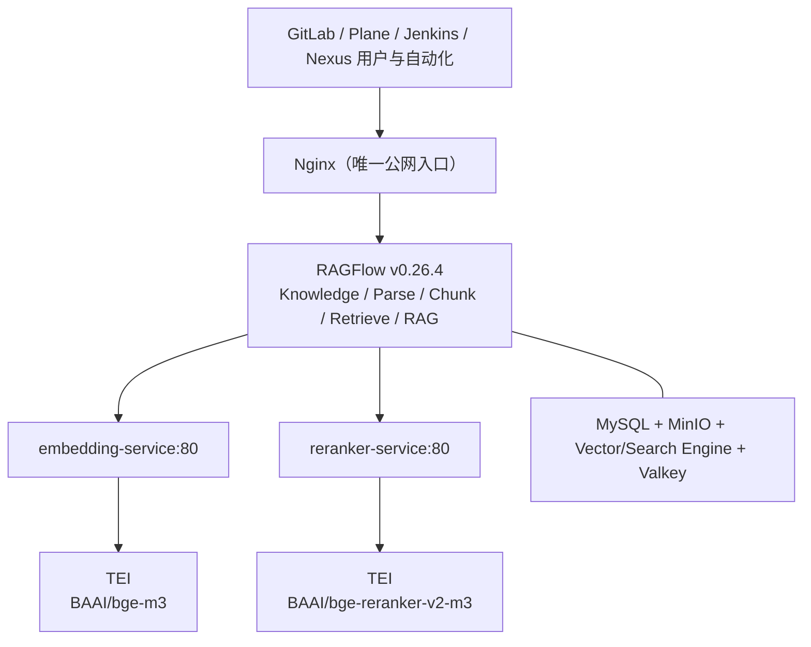
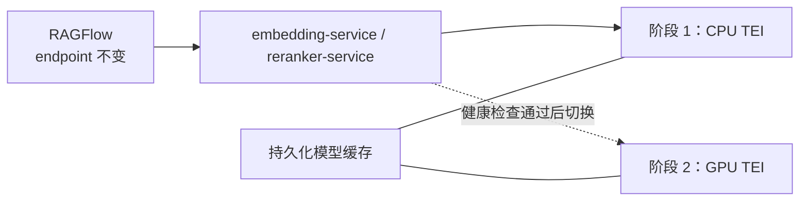

# 《RAGFlow 模型服务解耦架构设计 v1.0》

本文定义 RAGFlow 作为企业 DevOps 平台“知识侧载与检索应用”时的部署边界。RAGFlow 保持官方 Docker Compose；Embedding 与 Reranker 使用本目录唯一一份独立 `compose.yaml` 管理。模型 Compose 内有两个推理进程，但只有一个运维入口。

## 1. 当前 RAGFlow 版本分析

本设计以当前仓库在 2026-08-17 的实际状态为准：

- 源码提交：`3079e4f65903b658e92de932f148a81b135b7b1a`。
- 官方 Compose 默认镜像：`infiniflow/ragflow:v0.26.4`，见 `../.env` 的 `RAGFLOW_IMAGE`。
- 官方 Compose 已将 TEI 1.8 作为可选 embedding profile，但只定义一个 TEI 模型进程，见 `../docker-compose-base.yml`。
- RAGFlow 镜像不内置 embedding 模型；官方部署文档也明确如此。

源码分支可能领先于发布镜像。生产部署以 Compose 中显式固定的 `v0.26.4` 为准，不能把 `main` 提交号当作生产镜像版本。

## 2. 当前版本的官方支持方式

当前代码验证结果如下：

| 能力 | 结论 | 当前实现 |
|---|---|---|
| External Embedding API | 支持 | Model Provider 的自定义 `base_url` |
| External Reranker API | 支持 | Model Provider 的自定义 `base_url` |
| OpenAI-compatible Embedding | 支持 | `OpenAI-API-Compatible` 调用 `/v1/embeddings` |
| OpenAI-compatible Reranker | 有条件支持 | RAGFlow 定义 `/rerank` 的 Cohere/Jina 风格契约；OpenAI 没有统一 rerank 标准 |
| Local Model Provider | 支持 | HuggingFace/TEI、Xinference、Ollama、LocalAI、vLLM、GPUStack 等 |
| Custom Model Endpoint | 支持 | Provider Instance 可分别配置 endpoint 和模型 |

本方案使用 RAGFlow 的 `HuggingFace` provider：

- Embedding adapter 调 TEI `/embed`。
- Reranker adapter 调 TEI `/rerank`，请求字段为 `query`、`texts`，读取 `index`、`score`。
- 不修改 RAGFlow 核心代码，也不增加协议转换服务。

TEI 同时提供 `/v1/embeddings`，但为了让 embedding 与 reranker 都走 RAGFlow 当前明确支持的同一类 provider，本方案优先使用 TEI 原生接口。

## 3. 架构选择



边界如下：

- RAGFlow 拥有文档、Chunk、索引、检索编排和知识库配置。
- Model Service 只拥有模型缓存和推理计算，不拥有知识数据。
- Nginx 只发布 RAGFlow Web/API；模型端口默认仅绑定 `127.0.0.1`，容器间走私有 Docker network。
- RAGFlow 官方 Compose 与模型 Compose 是两个 project，可分别升级、重启和回滚。

## 4. 一套或两套 Model Service 对比

这里的“一套”指一个多模型推理进程，“两套”指 embedding/reranker 各一个进程。无论哪种方式，都只维护本目录一份 Compose。

| 维度 | 一个多模型进程 | 两个 TEI 进程 |
|---|---|---|
| CPU/内存 | 少量进程开销更低；两份模型权重仍必须加载 | 多一点 runtime 开销；权重总量基本相同 |
| GPU 显存 | 共享进程不等于共享模型显存 | 可先共用 GPU 0，以后分配不同 GPU |
| 模型加载 | 需要多模型控制面和启动编排 | 每个进程只加载一个模型，状态清晰 |
| 并发/扩容 | 两种负载互相争抢，难独立扩容 | 导入高峰扩 embedding，查询高峰扩 reranker |
| 故障隔离 | 一个进程故障同时影响导入和精排 | reranker 故障不破坏 embedding 进程 |
| Docker 管理 | 容器少，但模型注册和生命周期更复杂 | 容器多一个，Compose 操作仍简单 |
| 更换模型 | 常需处理进程内多模型路由 | 单独替换对应服务 |
| 增加 GPU | 需要框架内调度 | 直接改变 service 的 GPU device id |
| RagFlow 配置 | 一个 host、不同 API 路径 | 两个稳定 endpoint |

推荐：**一份 Compose、两个 TEI 服务**。这不是为了微服务而拆分，而是因为 TEI 一个进程只服务一个模型；强行合并需要换成更重的多模型控制面，不能减少模型权重，反而提高第一阶段维护成本。

## 5. 推理框架选择

| 框架 | Embedding | Reranker | CPU→NVIDIA GPU | 本场景判断 |
|---|---:|---:|---:|---|
| TEI | 是，含 OpenAI embedding API | 是，原生 `/rerank` | 同模型、同接口、换镜像 | 推荐；RAGFlow 当前已有精确 adapter 和官方 Compose 示例 |
| Xinference | 是 | 是，RAGFlow 有专用 provider | 支持 | 多模型和控制面更强，但需额外管理模型注册/启动 |
| Infinity Embedding | 是 | 是 | 支持 | 适合单进程多模型；注意它不是 RAGFlow 使用的 Infinity 向量库，当前集成不如 TEI 直接 |
| vLLM | 是（版本/模型相关） | 是（score/rerank，版本相关） | GPU 优先 | GPU 大模型吞吐优秀，CPU 第一阶段不是首选 |
| Ollama | 是 | 缺少与当前 RAGFlow 精确匹配的成熟原生 rerank 路径 | 支持 | 本地 LLM/embedding 易用，不作为本方案统一推理层 |
| FlagEmbedding 自建服务 | 模型库支持 | 模型库支持 | 可自行实现 | 它是模型/库而非稳定生产控制面，会引入自维护 API，排除 |
| LocalAI/GPUStack | 是 | 视框架与版本 | 支持 | 更通用但更重；需要统一管理更多模型时再评估 |

第一阶段选择 TEI 1.8.3，并同时固定容器 digest、模型 commit revision。不能只写 `latest` 或只记录 `bge-m3`。

## 6. 独立 Docker Compose

本目录结构对应生产机：

```text
/opt/devops/ragflow/                 # 官方 docker/ 目录内容
  docker-compose.yml
  docker-compose-base.yml
  .env
  ...

/opt/devops/ragflow-models/          # 本目录内容，独立维护
  compose.yaml
  .env
  model-manifest.json
  models/
  backup/
```

`compose.yaml` 提供两个互斥 profile：

- `models-cpu`：当前阶段，两个 CPU TEI 容器。
- `models-gpu`：未来阶段，两个 NVIDIA TEI 容器。

不要同时启用两个 profile；它们故意使用相同 network alias 和 host port，以保证 endpoint 稳定。

## 7. Docker Network

先用固定 project name 启动官方 RAGFlow：

```bash
cd /opt/devops/ragflow
docker compose -p ragflow up -d
```

官方 `ragflow` network 因而命名为 `ragflow_ragflow`。模型 Compose 把它声明为 external network，不需要改官方文件：

```yaml
networks:
  ragflow-internal:
    external: true
    name: ragflow_ragflow
```

同机 endpoint：

- Embedding：`http://embedding-service`
- Reranker：`http://reranker-service`

模型容器没有 `0.0.0.0` 的默认发布端口。`127.0.0.1:8080/8081` 只用于宿主机诊断，Nginx 不应代理这些端口。

## 8. CPU 部署

建议起始宿主机至少 16 个逻辑 CPU、24 GiB RAM，并为 RAGFlow 数据服务另留资源。默认给每个模型 8 CPU、8 GiB 上限；BGE-M3 与 reranker 都是约 568M 参数的 24 层 XLM-R 模型，CPU 推理和首次加载并不轻。低于该规格时先调低并发，不要通过取消内存上限掩盖容量问题。

```bash
cd /opt/devops/ragflow-models
cp .env.example .env
mkdir -p models backup
docker compose config
docker compose up -d
docker compose ps
curl --fail http://127.0.0.1:8080/health
curl --fail http://127.0.0.1:8081/health
```

第一次启动会下载模型，health 状态保持 `starting`；模型加载并完成 warm-up 后才变为 `healthy`。模型缓存位于 host `models/`，替换容器不会重新下载。

在 RAGFlow 的 Model Providers 中创建两个 `HuggingFace` instance：

| Instance | Model | Type | Base URL |
|---|---|---|---|
| `tei-embedding` | `BAAI/bge-m3` | Embedding | `http://embedding-service` |
| `tei-reranker` | `BAAI/bge-reranker-v2-m3` | Rerank | `http://reranker-service` |

然后把知识库 embedding 绑定到前者，把 Chat/Agent 的 retrieval reranker 绑定到后者。

## 9. GPU 部署

GPU 镜像必须匹配 compute capability。本模板默认 `86-1.8.3`（例如 A10/A40）；A100 使用 `1.8.3`，Ada 使用 `89-1.8.3`。变更 `.env` 中 `TEI_GPU_IMAGE` 时同时固定 registry digest。

安装 NVIDIA driver、Container Toolkit 后：

```bash
cd /opt/devops/ragflow-models
docker compose --profile models-cpu down
# 将 .env 中 COMPOSE_PROFILES 改为 models-gpu，并确认 TEI_GPU_IMAGE
docker compose up -d
docker compose ps
```

第一块 GPU 先由两个服务共享，`EMBEDDING_GPU_DEVICE_ID=0`、`RERANKER_GPU_DEVICE_ID=0`。只有在显存不足、导入与查询互相影响或 QPS 已被测量证明需要时，才增加第二块 GPU 并把 reranker 改为 device 1。

## 10. CPU → GPU Migration



同机迁移只切 profile；Docker alias 不变。异机迁移使用内部 DNS，而不是 Docker alias：

- `embedding-model.devops.internal:8080`
- `reranker-model.devops.internal:8081`

CPU 阶段就让 RagFlow 使用这两个 DNS 名。GPU Server 上把 `MODEL_BIND_ADDRESS` 设置为私网 IP，只允许 RagFlow Server 入站。先启动并验证 GPU 服务，再改变 DNS/LB 后端；RagFlow endpoint 文本完全不变。

## 11. Model Versioning

每次部署都复制 `model-manifest.example.json` 为受控的 `model-manifest.json`，记录：

- model id 与不可变 commit revision；
- tokenizer revision；
- dimension、pooling、normalization、prompt/instruction；
- runtime 名称、版本、容器 digest；
- 实际硬件与精度；
- 知识库到 document/chunk/embedding/reranker 版本的绑定。

RAGFlow v0.26.4 的 `Knowledgebase` 当前记录 `embd_id` 与 `parser_config`，没有完整 `embedding_fingerprint` 字段。因此 v1.0 不改核心表结构，版本清单由部署仓库/CMDB 管理。生产变更单必须同时更新它。

## 12. Embedding Fingerprint

兼容性 hash 只包含会改变向量语义契约的字段：

```json
{
  "dimension": 1024,
  "model_id": "BAAI/bge-m3",
  "model_revision": "5617a9f61b028005a4858fdac845db406aefb181",
  "normalization": "l2",
  "output_encoding": "float32",
  "pooling": "cls",
  "prompt": null,
  "tokenizer_revision": "5617a9f61b028005a4858fdac845db406aefb181"
}
```

在 Linux 上生成稳定 hash：

```bash
jq -cS '.embedding.compatibility' model-manifest.json | sha256sum
```

模板中上述对象的结果是 `6db091509f3a9ec41924568793733a2538cf47edab33c510de32214fcd6031b5`。修改任何兼容性字段后必须重新计算，不能手工沿用旧值。

CPU/GPU、TEI 版本和容器 digest 记录在 `runtime_provenance`，但不自动放入兼容性 hash。迁移前对固定样本做向量维数、归一化和 cosine 差异验收；结果在既定容差内，CPU→GPU 不重建 embedding。若 runtime/precision 改变导致结果越过验收容差，则把它视为 fingerprint 变化。

## 13. Reranker 与版本边界

Embedding pipeline：

```text
Document -> Parse -> Chunk -> Embedding -> Vector Index
```

Reranking pipeline：

```text
Query -> Query Embedding -> Candidate Retrieval -> Reranker -> Final Candidates
```

Reranker 不写入文档向量索引。仅改变 reranker model/revision、top_n 或 rerank 参数时，不需要重新 Parse、Chunk 或 Embedding；只需更新 retrieval 配置并完成离线检索评测。

## 14. Chunk 与数据版本

每个知识库至少管理四个互相独立的版本：

| 版本 | 典型内容 | 变化影响 |
|---|---|---|
| Document Version | Git commit、Wiki revision、制品 digest | 变化文档需重新处理 |
| Chunk Version | parser、chunk tokens、overlap、delimiter、layout 配置 | 必须重新 Chunk + Embedding |
| Embedding Version | embedding compatibility hash | 必须重建向量索引 |
| Reranker Version | model revision 与 retrieval 参数 | 只影响在线候选排序 |

`512 tokens → 1024 tokens` 即使 embedding 模型完全不变，也会改变向量输入集合，必须重新 Chunk 和 Embedding。

## 15. Health Check

Compose 使用 TEI `/health`，该接口检查 inference backend，而非只检查进程端口：

- `starting`：下载、加载或 warm-up 中；
- `healthy`：模型已可推理；
- `unhealthy`：连续请求失败，需检查容器日志、内存和模型文件。

探针给首次下载/CPU 加载预留 10 分钟 `start_period`。离线环境应提前把固定 revision 下载到 `models/`，并在验收后再启用离线模式。

## 16. Monitoring

Prometheus 抓取：

- `http://embedding-service/metrics`
- `http://reranker-service/metrics`

TEI 提供请求数、失败、排队、tokenization、inference 和总耗时等 `te_*` 指标。补充：

- cAdvisor：容器 CPU、内存、重启、OOM；
- node_exporter：主机资源；
- dcgm-exporter：GPU 利用率、显存、温度；
- 从容器 start 到 health ready 的时长：模型加载时间 SLI。

Grafana 至少告警：health 非 ready、5xx/429、P95/P99 延迟、队列时间、OOM/restart、CPU 饱和、GPU 显存接近上限。

## 17. API Key 与网络安全

TEI 支持 `--api-key`，但 RAGFlow v0.26.4 的 `HuggingFace` embedding/rerank adapters 当前不发送 `Authorization` header。直接打开 TEI API key 会使官方 adapter 调用失败。

因此 v1.0 的安全边界是：

- 同机只通过 external Docker bridge 访问；host port 绑定 loopback；
- 异机使用私网/VPN，模型端口仅放行 RagFlow host；
- 不经 Nginx 暴露公网；
- 不在 Compose 中硬编码 secret。

若合规要求应用层鉴权，优先切换到 RagFlow 明确支持鉴权的 Xinference/provider，或在两端之间加入现有企业 mTLS/auth gateway；不要修改 RAGFlow 核心，也不要临时发明私有协议。

## 18. Backup

必须备份：

- RAGFlow MySQL/PostgreSQL 数据；
- MinIO 对象；
- 选定 vector/search engine 数据与对应恢复步骤；
- RAGFlow `.env`、Compose、Nginx 配置；
- `model-manifest.json` 与知识库版本绑定；
- `.env` 中敏感值应进入企业 secret backup，而不是 Git。

`models/` 是可由固定 revision 重建的 cache，不是唯一数据源。网络受限环境可备份它以缩短恢复时间，但恢复演练必须验证 revision 和文件 digest。

## 19. Failure / Degraded Mode

| 故障 | 当前影响 | 降级方式 |
|---|---|---|
| Embedding down | 新增/更新知识失败；普通语义查询也需要生成 query embedding，因此通常失败 | 文档管理/UI 与已存数据仍在；恢复 embedding 后无需重建已有索引 |
| Reranker down | 启用了该 reranker 的检索请求会失败 | 将 retrieval 配置切为“不使用外部 reranker”，回退到 vector + keyword 排序 |
| 单个模型过载 | 429/延迟上升 | 降低导入并发、限流、独立扩对应服务 |

RAGFlow 当前代码不会在 reranker HTTP 失败时自动切换为无 reranker；“自动降级”需要平台层健康监控调用配置变更，或稳定的内部 gateway。v1.0 先采用有审计的人工/自动化 runbook，避免为降级修改 RAGFlow 核心。

## 20. Model Upgrade 与渐进迁移

Embedding 升级采用 blue/green：

1. 复制 `.env`，使用新 model revision、不同 alias（例如 `embedding-service-v2`）和不同 host port。
2. 用同一 `compose.yaml`、不同 project name 启动 V2。
3. 在 RAGFlow 创建新的 HuggingFace provider instance。
4. 新知识库绑定 V2；旧知识库继续绑定 V1。
5. 对旧知识库逐个重新 Chunk/Embedding 或仅重新 Embedding，验收后切换。
6. 没有知识库引用 V1 后再下线。

示例：

```bash
docker compose -p ragflow-models-v2 --env-file .env.v2 up -d
```

不要把同一个知识库的既有向量和不同 embedding fingerprint 的 query 向量混用。Reranker 升级不需要 blue/green 索引，可先建新 provider instance 做 A/B 检索评测，再切 retrieval 配置。

## 21. 必须重新 Embedding 的条件

以下任一变化都应重建相关知识库向量：

- model id 或不可变 revision 改变；
- tokenizer、dimension、pooling、normalization 改变；
- embedding prompt/instruction 或输入预处理改变；
- 精度/runtime 变化造成向量差异超过验收容差；
- chunk strategy、chunk size、overlap、delimiter、parser/layout 策略改变；
- 原始文档版本改变（至少重建受影响文档）。

只有 CPU→GPU，且模型权重、revision、tokenizer、维数、pooling、normalization、prompt 均相同，固定样本验收也通过时，不需要重新 Embedding。

## 22. 最终推荐

1. RAGFlow 保持官方 Docker Compose 和 `v0.26.4` 发布镜像。
2. 不修改官方 Compose；用固定 project name 暴露其现有内部 network 给独立模型 Compose。
3. 只维护一份模型 `compose.yaml`，其中 embedding/reranker 为两个 TEI service。
4. 第一阶段使用 TEI 1.8.3 CPU 镜像和固定 BGE model revision。
5. GPU 阶段只切模型 Compose profile/image/device，不动 RAGFlow 数据和索引。
6. CPU→GPU 在 compatibility fingerprint 相同且样本验收通过时不重新 Embedding。
7. Embedding/Chunk 契约变化才重建向量；仅 reranker 变化只做检索评测与配置切换。
8. 模型 cache、manifest、runtime 与 RAGFlow 生命周期分开。
9. 同机用 Docker private network；异机用内部 DNS + 私网防火墙，CPU 阶段就使用最终 DNS 名可做到 endpoint 不变。
10. 暂不为多 GPU、多模型或自动降级增加自研控制面；以观测数据触发下一阶段演进。

## 23. 实施步骤

1. 备份当前 RAGFlow 数据和配置，记录 `v0.26.4` 镜像 digest。
2. 以 `docker compose -p ragflow` 重建/确认官方 stack，检查 `ragflow_ragflow` network。
3. 复制本目录到 `/opt/devops/ragflow-models`，生成 `.env` 和 `model-manifest.json`。
4. 确认磁盘、CPU、内存容量，启动 `models-cpu`。
5. 等待两个容器 healthy，执行 embedding 与 rerank smoke test。
6. 在 RAGFlow 创建两个 HuggingFace provider instance，先用测试知识库导入和查询。
7. 接入 Prometheus/Grafana、日志和告警，记录基线 latency/throughput。
8. 为 GitLab、Plane、Jenkins、Nexus 分别定义数据源、同步频率、document version 与访问权限。
9. 执行备份恢复、embedding down、reranker down 和 CPU 容量演练。
10. GPU 到位后先在独立 endpoint 验证 fingerprint/数值容差，再按本章迁移。

## 24. 本地验收请求

Embedding：

```bash
curl http://127.0.0.1:8080/v1/embeddings \
  -H 'Content-Type: application/json' \
  -d '{"model":"BAAI/bge-m3","input":["RAGFlow DevOps knowledge retrieval"]}'
```

Reranker：

```bash
curl http://127.0.0.1:8081/rerank \
  -H 'Content-Type: application/json' \
  -d '{"query":"How did the Jenkins build fail?","texts":["Build log and stack trace","Nexus repository policy"],"truncate":true}'
```

返回向量维数必须为 1024；reranker 返回按 `score` 排序的 `index`。这两个 smoke test 通过后，才能在 RAGFlow 中注册 provider。
